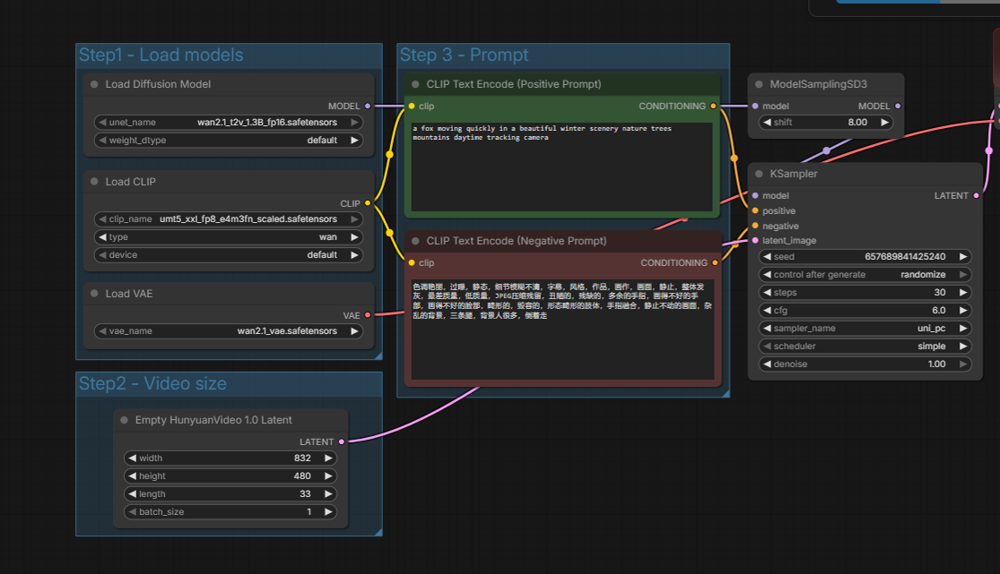
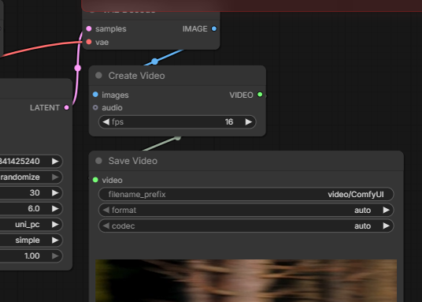

🎬 Agentic Video Synthesizer: Script2Scene

&nbsp;&nbsp;

<b>The  modular Multi-Agent System that bridges the gap between raw imagination and cinematic reality.</b>
🌟 The VisionScript2Scene is a sophisticated Multi-Agent System (MAS) designed to automate the end-to-end creative pipeline of filmmaking. By orchestrating LLM-based reasoning with state-of-the-art Diffusion models like Wan 2.2 and LTX-Video, we have constructed a pipeline that transcends simple prompting. This system understands narrative arc, emotional 🌟 The Vision
Script2Scene is a sophisticated Multi-Agent System (MAS) designed to automate the end-to-end creative pipeline of filmmaking.

Beyond Prompting: It transcends simple text-to-video by orchestrating LLM-based reasoning with state-of-the-art Diffusion models like Wan 2.1 and LTX-Video.

Narrative Intelligence: The system understands complex narrative arcs, emotional subtext, and advanced cinematography.

Production Ready: Delivering a high-quality, edited output from a single, raw text input.

🧠 Core Agent Intelligence & Architecture
The system follows a Facade Design Pattern, where a central Orchestrator manages three highly specialized agents. This decoupling allows for modular upgrades—such as swapping the LLM or the video generation backbone—without disrupting the core pipeline.

The Director Agent
Technology: Gemini 2.5 Flash

Responsibility: Performs deep semantic analysis on raw text to identify key scenes.

Output: Generates detailed visual prompts including precise camera angles (e.g., Dutch angle, tracking shots) and lighting schemes (e.g., Volumetric, Cyberpunk neon).

The Artist Agent
Technology: ComfyUI API

Responsibility: Acts as the Synthesis Engine, managing the entire lifecycle of a video render.

Capabilities: Handles API queuing, real-time status polling, and binary retrieval over secure tunnels to remote GPU clusters.

The Editor Agent
Technology: FFmpeg

Responsibility: Manages automated post-production and programmatic assembly.

Refinement: Ensures codec consistency, frame-rate synchronization, and executes high-speed lossless concatenation.

⚡ Technical Breakthroughs & Engineering
🛡️ Automated Tunnel Handshake (Pinggy Bypass)
The Challenge: Splash screen interdiction from tunnel services often breaks automated API calls.

The Solution: Engineered a custom Python Session handler that injects X-Pinggy-No-Screen headers.

Result: A 100% automated handshake with remote Google Colab instances.

💎 Robust JSON Intelligence & Extraction
The Challenge: LLMs often return "chatty" responses or markdown backticks that break standard parsers.

The Solution: Implemented a Robust Extraction Layer using regular expressions and deep-JSON validation.

Result: Error-free data extraction regardless of the LLM's conversational prose.

🏗️ Memory-Aware Synthesis (Wan 2.1 1.3B on T4)
Executing a 5-Billion parameter model on a 16GB VRAM Tesla T4 is an engineering challenge solved through:

Quantized Sampling: Running models in FP8/GGUF to fit within strict memory constraints.

Tiled VAE Decoding: Breaking final video latents into smaller "tiles" to prevent CUDA Out-of-Memory (OOM) errors during high-resolution rendering.

🚀 Future Roadmap
[ ] Voice Synthesis Agent: Integration with ElevenLabs for high-fidelity character dialogue.

[ ] Soundscape Agent: Procedural background music and SFX generation via Suno or Udio.

[ ] Temporal RAG: A "Character Sheet" system to ensure character consistency across all generated scenes.

🧩 The Backend: ComfyUI Architecture
The generation logic is powered by a custom node-graph, allowing for intricate control over the diffusion process, including custom LoRAs and ControlNets. 

 
 📽️ Final Production ShowcaseWitness the power of agentic automation. The video below was generated, downloaded, and stitched with zero human manual effort after the initial script was provided.

<!--  
<kbd>

<video width="320" height="240" controls>
  <source src="./outputs/test_output.mp4" type="video/mp4">
</video> -->

https://github.com/user-attachments/assets/b820fb91-7924-4765-963b-14da8c344657

</kbd>
<i>"A romantic, cinematic short story rendered in Wan 2.1"</i>

 
